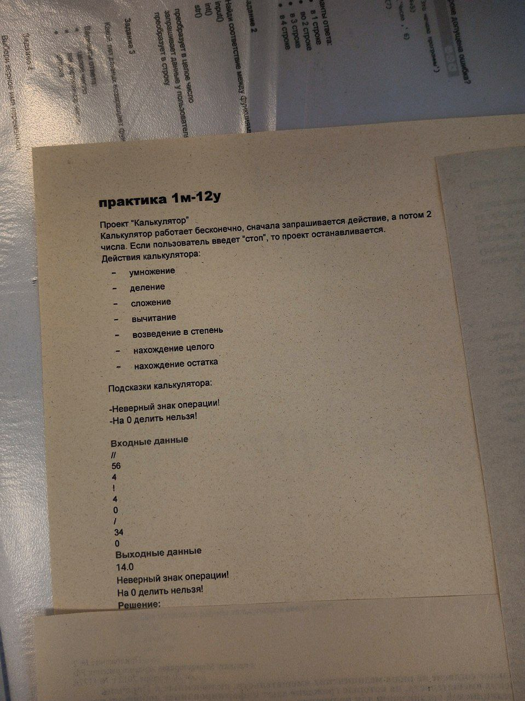

# Кейс "Калькулятор на Python"

Калькулятор работает бесконечно. Сначала запрашивается действие, потом два числа. Если пользователь введет "стоп", то проект останавливается.

Действия калькулятора:
- умножение
- деление
- сложение
- вычитание
- возведение в степень
- нахождение целого
- нахождение остатка

Подсказки калькулятора:
- Неверный знак операции!
- На ноль делить нельзя!

